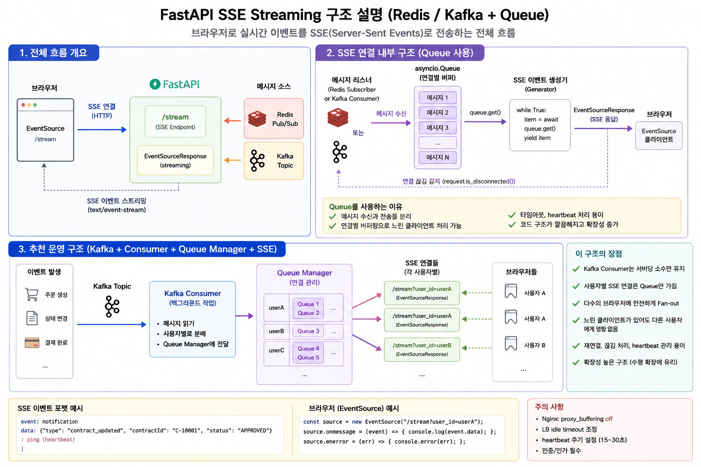

# SSE 스트리밍 — Redis 폴링 vs pub/sub vs Streams vs Kafka 비교

> **핵심 질문:** Kafka Worker가 LLM 결과를 처리한 후, 클라이언트에 실시간으로 결과를 전달할 때
> 어떤 방식이 적합한가?



---

## 배경: 비동기 LLM 처리 후 결과 전달 문제

```
Client → POST /chat/async → Kafka → Kafka Worker → LLM 처리 (2~30s)
                                                         │
                                                    결과를 Client에
                                                    어떻게 전달할까?
```

4가지 방식 존재.

---

## 방식 1: Redis 폴링 (이전 구현)

```
Kafka Worker → Redis.setex("llm:result:{job_id}", result)

Client → GET /chat/stream/{job_id} → 0.5초마다 Redis 확인 → 결과 있으면 SSE 전송
```

```python
async def _poll():
    client = get_redis_client()
    for _ in range(120):          # 최대 60초 대기
        result = await client.get(f"llm:result:{job_id}")
        if result:
            yield {"data": result}
            return
        await asyncio.sleep(0.5)  # 0.5초 폴링 간격
```

**장점:** 구현 단순, 재연결 후 결과 조회 가능  
**단점:** 0.5초 지연, Redis에 반복 GET 부하, 완성된 결과를 한 번에 전달 (청크 스트리밍 불가)

---

## 방식 2: Redis pub/sub + SSE

```
Kafka Worker → Redis.publish("result:{job_id}", result)

Client → GET /chat/stream/{job_id}
  → Redis.subscribe("result:{job_id}")
  → 메시지 수신 즉시 SSE 전송
```

```python
async def sse_from_redis_pubsub(job_id: str):
    redis = get_redis_client()
    pubsub = redis.pubsub()
    await pubsub.subscribe(f"result:{job_id}")
    try:
        async for message in pubsub.listen():
            if message["type"] == "message":
                yield f"data: {message['data']}\n\n"
                break
        yield "data: [DONE]\n\n"
    finally:
        await pubsub.unsubscribe(f"result:{job_id}")
        await pubsub.close()
```

**장점:** 이벤트 기반, 폴링 지연 없음  
**단점:** 구독 전에 워커가 발행하면 메시지 유실, 영속성 없음 (재연결 시 재수신 불가), 청크 스트리밍 불가

---

## 방식 3: Redis Streams + SSE ✅ (현재 구현)

```
Kafka Worker → chat_stream() 청크 단위 실행
  → 청크마다 XADD stream:llm:{job_id} {type:chunk, data:...}
  → 완료 시 XADD {type:end}

Client → GET /chat/stream/{job_id}
  → XREAD BLOCK stream:llm:{job_id}
  → 청크 도착 즉시 SSE 전송 (토큰 단위 스트리밍)
```

```python
# stream_consumer.py
async def iter_job_stream(job_id: str, timeout_ms: int = 60_000):
    client = get_redis_client(get_settings().redis_stream_db)
    last_id = "0"
    elapsed = 0
    while elapsed < timeout_ms:
        messages = await client.xread(
            streams={f"stream:llm:{job_id}": last_id},
            block=min(5_000, timeout_ms - elapsed),
            count=50,
        )
        if messages:
            for _, msgs in messages:
                for msg_id, fields in msgs:
                    last_id = msg_id
                    yield fields
                    if fields.get("type") in ("end", "error"):
                        return
        elapsed += 5_000
    yield {"type": "timeout"}

# routes/chat.py
async def _stream():
    async for fields in iter_job_stream(job_id):
        match fields.get("type"):
            case "chunk": yield {"data": fields["data"]}
            case "end":   await mark_complete(job_id); return
            case "error": yield {"event": "error", "data": fields.get("data", "")}; return
            case "timeout": yield {"event": "timeout", "data": "Request timed out"}
```

**장점:**
- 토큰 단위 청크 스트리밍 (첫 토큰부터 즉시 표시)
- 영속 저장 → 재연결 후 `last_id=0`으로 처음부터 재수신 가능
- 구독 전 발행되어도 메시지 유실 없음

**단점:** pub/sub보다 구현 복잡, `EXPIRE` 명시 필요

상세 구현: [Redis Streams](./07-redis-streams)

---

## 방식 4: Kafka Result Topic + SSE

```
Kafka Worker → Kafka.produce("llm-results", {job_id, result})

Client → GET /chat/stream/{job_id}
  → FastAPI가 "llm-results" 토픽 임시 Consumer 생성
  → job_id 매칭 메시지 수신 → SSE 전송
```

```python
async def sse_from_kafka_result(job_id: str):
    consumer = AIOKafkaConsumer(
        "llm-results",
        bootstrap_servers=settings.kafka_bootstrap_servers,
        group_id=f"sse-{job_id}",  # 요청별 고유 group_id
        auto_offset_reset="latest",
    )
    await consumer.start()
    try:
        async for msg in consumer:
            data = msg.value
            if data.get("job_id") == job_id:
                yield f"data: {data['result']}\n\n"
                yield "data: [DONE]\n\n"
                break
    finally:
        await consumer.stop()
```

**장점:** 결과가 Kafka에 영속 저장 (replay 가능), 다운스트림 서비스도 동일 토픽 소비 가능  
**단점:** 요청마다 Kafka Consumer 생성/종료 오버헤드, 모든 메시지 스캔하며 job_id 매칭 비효율

> 가능하면 `background consumer → manager.publish() → 사용자별 queue → SSE` 구조로 개선 필요.

---

## 4가지 방식 비교

| 항목 | Redis 폴링 | Redis pub/sub | Redis Streams ✅ | Kafka result topic |
|------|-----------|---------------|-----------------|-------------------|
| 실시간성 | 최대 0.5초 지연 | **즉시** | **즉시** | **즉시** |
| 청크 스트리밍 | 불가 | 가능 | **가능** | 가능 |
| 메시지 유실 위험 | 없음 (key 저장) | 있음 (구독 전 발행) | **없음 (영속)** | 없음 (영속) |
| 재연결 후 재수신 | 가능 (key 조회) | 불가 | **가능 (last_id)** | 가능 (replay) |
| Redis 부하 | 높음 (폴링) | **낮음** | **낮음** | 없음 |
| 구현 복잡도 | 낮음 | 중간 | 중간 | 높음 |
| 다운스트림 활용 | 불가 | 불가 | 불가 | 가능 |

---

## LangChain 토큰 단위 스트리밍 (동기 경로)

비동기 Kafka 경로가 아닌 **동기 스트리밍** 경로에서는 LangChain `astream()`으로 직접 SSE:

```python
# chains/chat_chain.py
async def chat_stream(session_id, user_input, provider) -> AsyncIterator[str]:
    chain = build_chain(provider)
    async for chunk in chain.astream({"input": user_input, ...}):
        yield chunk  # LLM이 토큰 생성할 때마다 즉시 yield

# routes/chat.py
@router.post("/chat/stream/direct")
async def chat_stream_direct(body: ChatRequest):
    stream = chat_stream(body.session_id, body.input, body.provider)
    return EventSourceResponse(sse_generator(stream))
```

::: info EventSourceResponse 주의
`sse-starlette`의 `EventSourceResponse`는 dict를 받아 `data: ...` 형식으로 변환한다.
문자열 `f"data: ...\n\n"`을 yield하면 `data: data: ...`로 이중 인코딩된다.
:::

---

## 권장 구성

```
동기 스트리밍 (짧은 요청):
  POST /chat/stream/direct → LangChain astream → SSE (토큰 단위)

비동기 LLM 처리 (Kafka 큐):
  POST /chat/async → Kafka → Kafka Worker
    → Redis Streams XADD 청크 (실시간 토큰 전달)
    → Redis SET 완성 결과 (재연결/폴링 fallback)
  GET /chat/stream/{job_id} → XREAD BLOCK → SSE (청크 단위)
  GET /chat/job/{job_id}    → Redis GET    → JSON (폴링 클라이언트)

장시간 작업 (이미지 생성 등):
  POST /task/async → Kafka → Celery Worker
  GET /task/job/{job_id} → Redis GET 폴링 (SSE 불필요)

다운스트림 서비스 필요 시:
  Kafka Worker → llm-results 토픽도 병행 발행
  → 알림 서비스, 로깅 파이프라인 등이 독립 소비
```

---

## 관련 파일

- `app/core/messaging/stream_producer.py`
- `app/core/messaging/stream_consumer.py`
- `app/api/v1/routes/chat.py`
- `app/workers/kafka_worker.py`
- `app/utils/streaming.py`
- [Redis Streams 상세 구현](./07-redis-streams)
