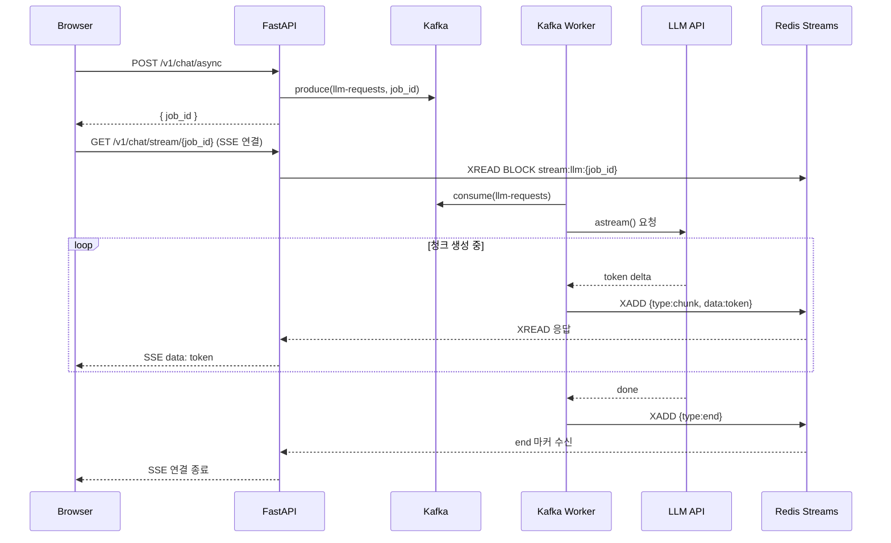

# Redis Streams — Kafka 비동기 처리 + 실시간 SSE

## 왜 Redis Streams인가

| 방식 | 문제점 |
|------|--------|
| Redis 폴링 | 0.5초 지연 + Redis GET 반복 부하 |
| Redis pub/sub | 구독 전 발행 시 메시지 유실, 영속성 없음 |
| **Redis Streams** ✅ | 순서 보장 + 영속 + XREAD BLOCK으로 즉시 수신 |

Kafka는 요청 큐(비동기 작업 분산)에 적합하고,  
Redis Streams는 결과 청크를 순서대로 실시간 전달하는 notification channel에 적합하다.

---

## 두 가지 비동기 패턴

### 패턴 A — LLM 채팅 (Kafka 요청 큐 + Redis Streams 결과 전달)

```
POST /v1/chat/async
  → Kafka llm-requests 발행 (요청 큐)
  → job_id 즉시 반환

Kafka Worker:
  → chat_stream() 청크 단위 실행
  → 청크마다 XADD stream:llm:{job_id} {type:chunk, data:...}
  → 완료 시 XADD {type:end}
  → 완성 결과 Redis SET (GET 폴링 호환)

SSE /v1/chat/stream/{job_id}:
  → XREAD BLOCK stream:llm:{job_id}
  → 청크 도착 즉시 클라이언트로 SSE 전송
```

### 패턴 B — 장시간 작업 / 이미지 생성 (Kafka + GET 폴링)

```
POST /task/async
  → Kafka 발행 → Celery Worker 처리
  → 완료 시 Redis SET result

GET /task/job/{job_id}
  → Redis GET 폴링 응답 (SSE 불필요)
```

---

## 전체 흐름 시퀀스



---

## 구현 — stream_producer.py

```python
# app/core/messaging/stream_producer.py
async def xadd_chunk(job_id: str, chunk: str) -> None:
    settings = get_settings()
    await get_redis_client(settings.redis_stream_db).xadd(
        f"stream:llm:{job_id}", {"type": "chunk", "data": chunk}
    )

async def xadd_done(job_id: str) -> None:
    settings = get_settings()
    client = get_redis_client(settings.redis_stream_db)
    await client.xadd(f"stream:llm:{job_id}", {"type": "end"})
    await client.expire(f"stream:llm:{job_id}", settings.stream_chunk_ttl_seconds)

async def xadd_error(job_id: str, error: str) -> None:
    settings = get_settings()
    client = get_redis_client(settings.redis_stream_db)
    await client.xadd(f"stream:llm:{job_id}", {"type": "error", "data": error})
    await client.expire(f"stream:llm:{job_id}", settings.stream_chunk_ttl_seconds)
```

::: tip job별 독립 스트림
단일 글로벌 스트림(`stream:llm`) 대신 `stream:llm:{job_id}` 패턴으로 job마다 분리.
소비자가 job_id 필터링 없이 XREAD만으로 자기 결과만 수신 가능.
:::

---

## 구현 — stream_consumer.py

```python
# app/core/messaging/stream_consumer.py
async def iter_job_stream(job_id: str, timeout_ms: int = 60_000) -> AsyncIterator[dict]:
    """XREAD BLOCK으로 청크 순서대로 yield. end/error/timeout 수신 시 종료."""
    client = get_redis_client(get_settings().redis_stream_db)
    last_id = "0"
    elapsed = 0
    while elapsed < timeout_ms:
        messages = await client.xread(
            streams={f"stream:llm:{job_id}": last_id},
            block=min(5_000, timeout_ms - elapsed),
            count=50,
        )
        if messages:
            for _, msgs in messages:
                for msg_id, fields in msgs:
                    last_id = msg_id
                    yield fields
                    if fields.get("type") in ("end", "error"):
                        return
        elapsed += 5_000
    yield {"type": "timeout"}
```

**last_id = "0"**: 스트림의 처음부터 읽는다.  
SSE 클라이언트 재연결 시에도 이미 쌓인 청크를 순서대로 재수신 가능.  
(pub/sub은 재연결 시 이전 메시지 유실, Streams는 재수신 가능)

---

## 구현 — kafka_worker.py 변경

```python
# 변경 전
result = await chat_invoke(session_id=..., user_input=..., provider=...)
await _store_result(job_id, result)

# 변경 후
chunks: list[str] = []
async for chunk in chat_stream(session_id=..., user_input=..., provider=...):
    await xadd_chunk(job_id, chunk)   # 청크마다 즉시 스트림에 추가
    chunks.append(chunk)

complete_result = "".join(chunks)
await _store_result(job_id, complete_result)   # GET /chat/job/{job_id} 호환 유지
await xadd_done(job_id)
```

에러 최종 실패 시: `await xadd_error(job_id, str(exc))` 추가 (재시도 중에는 스트림에 에러 미발행).

---

## 구현 — chat.py SSE 엔드포인트 변경

```python
# 변경 전 — Redis 0.5초 폴링
async def _poll():
    for _ in range(120):
        result = await client.get(f"llm:result:{job_id}")
        if result:
            yield {"data": result}
            return
        await asyncio.sleep(0.5)

# 변경 후 — XREAD BLOCK
async def _stream():
    async for fields in iter_job_stream(job_id):
        match fields.get("type"):
            case "chunk":
                yield {"data": fields["data"]}
            case "end":
                await mark_complete(job_id)
                return
            case "error":
                yield {"event": "error", "data": fields.get("data", "")}
                return
            case "timeout":
                yield {"event": "timeout", "data": "Request timed out"}
```

---

## Redis Streams vs pub/sub 비교

| 항목 | pub/sub | Streams |
|------|---------|---------|
| 영속성 | 없음 (fire-and-forget) | 있음 (키에 저장) |
| 재연결 후 재수신 | 불가 | 가능 (last_id 지정) |
| 순서 보장 | 없음 | 있음 (ID 단조증가) |
| 소비자 그룹 | 없음 | 있음 (XREADGROUP) |
| 청크 단위 스트리밍 | 가능 (채널당 1메시지씩) | 가능 (스트림에 순서대로 추가) |
| TTL 자동 정리 | 채널 소멸로 자동 | `EXPIRE` 명시 필요 |

---

## 설정

```python
# config.py
redis_stream_db: int = 6           # 기존 0~5와 분리된 전용 DB
stream_chunk_ttl_seconds: int = 3600  # 스트림 키 자동 만료
```

```yaml
# kubernetes/configmap.yaml
REDIS_STREAM_DB: "6"
STREAM_CHUNK_TTL_SECONDS: "3600"
```

---

## 관련 파일

- `app/core/messaging/stream_producer.py`
- `app/core/messaging/stream_consumer.py`
- `app/workers/kafka_worker.py`
- `app/api/v1/routes/chat.py`
- `app/core/config.py`
- [SSE 스트리밍 방식 비교](./06-sse-streaming)
