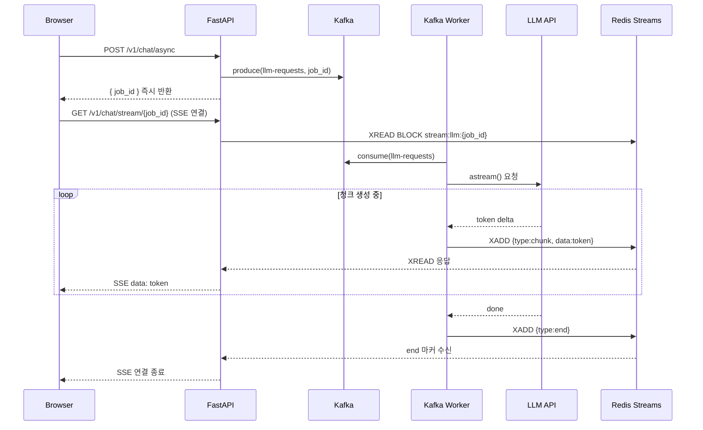

# 대규모 트래픽 처리 — 개요 및 전체 아키텍처

> LangChain 기반 AI 서비스(`agent-be`)에서 App 레이어 수준으로 대규모 트래픽을 처리하는 전략 모음.
> 인프라 스케일링(HPA)과 별개로, **코드 레벨에서** 해결하는 것들에 집중.

https://github.com/all-day-and-night/agent-be

---

## 전체 요청 흐름

```
┌──────────────────────────────────────────────────────────┐
│                         Client                           │
└──────────────────────────┬───────────────────────────────┘
                           │
          ┌────────────────┴────────────────┐
          │                                 │
          ▼                                 ▼
 ┌─────────────────────┐          ┌──────────────────────┐
 │ POST /chat/completions│          │  POST /chat/async    │
 │ (동기 스트리밍)       │          │  (Kafka 비동기)       │
 └──────────┬──────────┘          └──────────┬───────────┘
            │ Rate Limit 체크                  │ Dedup 체크
            │ Semantic Cache 히트?             ▼
            ├─ 캐시 히트 → 즉시 반환   ┌──────────────────┐
            ▼ 캐시 미스                │  Kafka           │
 ┌─────────────────────┐             │  llm-requests    │
 │  LangChain LCEL 체인 │             └──────────┬───────┘
 │  (with_retry 적용)   │                        │
 │  Circuit Breaker 체크│             ┌──────────▼───────┐
 └──────────┬──────────┘             │  Kafka Worker    │
            ▼                        │  chat_stream()   │
 ┌─────────────────────┐             └──────────┬───────┘
 │  LLM Provider        │                        │ 청크마다
 │  OpenAI / Bedrock /  │             ┌──────────▼───────┐
 │  Local / EKS         │             │  Redis Streams   │
 └──────────┬──────────┘             │  stream:llm:{id} │
            ▼                        └──────────┬───────┘
 ┌─────────────────────┐                        ▼
 │  SSE 스트리밍 반환   │             ┌──────────────────┐
 │  (토큰 단위)         │             │  SSE XREAD BLOCK │
 └─────────────────────┘             │  (청크 단위)      │
                                     └──────────────────┘

  Celery Worker (Redis Broker)
  └─ 배치 처리, 임베딩, 주기적 정리 (장시간 작업 전용)
```

---

## 각 기법 요약

| 기법 | 해결 문제 | 문서 |
|------|-----------|------|
| [Redis 시맨틱 캐시](./01-redis-semantic-cache) | 반복 질문 중복 LLM 호출 | |
| [Idempotency Key](./02-idempotency) | 중복 요청 이중 LLM 호출 | |
| [Rate Limiting](./03-rate-limiting) | 공급자 쿼터 소진, 서비스 보호 | |
| [Exponential Backoff](./04-exponential-backoff) | 일시적 LLM API 오류 | |
| [Circuit Breaker](./05-circuit-breaker) | 공급자 장애 시 cascade 방지 | |
| [SSE 스트리밍 비교](./06-sse-streaming) | 실시간 결과 전달 방식 선택 | |
| [Redis Streams](./07-redis-streams) | Kafka 비동기 결과 청크 실시간 SSE 전달 | |
| [Celery 백그라운드](./08-celery) | 배치/주기 작업이 API에 영향 | |
| [Observability](./09-observability) | 장애 원인 추적 불가 | |

---

## 스택 한눈에 보기

```
FastAPI (비동기 API 서버)
  ├── slowapi          → Rate Limiting (Fixed Window, Redis 기반)
  ├── sse-starlette    → SSE 스트리밍 응답
  └── prometheus       → 메트릭 노출

LangChain (AI 오케스트레이션)
  ├── LCEL             → 체인 파이프라인 (with_retry 내장)
  ├── RedisSemanticCache → 시맨틱 캐시
  └── RedisChatMessageHistory → 대화 히스토리

Redis
  ├── DB 0: 시맨틱 캐시 (임베딩 벡터 저장)
  ├── DB 1: 세션/대화 히스토리
  ├── DB 2: Celery Broker
  ├── DB 3: Celery Result Backend
  ├── DB 4: Idempotency Key (dedup)
  ├── DB 5: Rate Limiting
  └── DB 6: Redis Streams (LLM 청크 실시간 전달)

Kafka
  ├── llm-requests  → LLM 비동기 요청 큐
  ├── llm-results   → 처리 완료 결과 (다운스트림 서비스용)
  └── llm-requests-dlq → Dead Letter Queue (최대 재시도 초과)

Celery
  ├── 배치 LLM 처리 (장시간 작업)
  ├── 문서 임베딩
  └── 주기적 세션 정리 (Beat)

LLM Provider
  └── OpenAI / Ollama (Local) / EKS vLLM / AWS Bedrock
```

---

## 비동기 처리 시퀀스


